# Vehicle Tracking
Udacity Self Driving Nanodegree - Vehicle Tracking project

**The goals**

- Perform a Histogram of Oriented Gradients (HOG) feature extraction on a labeled training set of images and train a classifier Linear SVM classifier
- Optionally, you can also apply a color transform and append binned color features, as well as histograms of color, to your HOG feature vector.
- Implement a sliding-window technique and use your trained classifier to search for vehicles in images.
- Run your pipeline on a video stream and create a heat map of recurring detections frame by frame to reject outliers and follow detected vehicles.
- Estimate a bounding box for vehicles detected.

## Datasets

|Label | Link|
|----- |---- |
|Vehicles | https://s3.amazonaws.com/udacity-sdc/Vehicle_Tracking/vehicles.zip |
|Non vehicles | https://s3.amazonaws.com/udacity-sdc/Vehicle_Tracking/non-vehicles.zip |
|Annotated data from Udacity Self-driving car repo [by Autti] | http://bit.ly/udacity-annotations-autti |

More datasets:
https://github.com/udacity/self-driving-car/tree/master/annotations

## Colorspaces and histograms

This visualization helps to understand data and to choose proper colorspace.
Here are examples from cars and non-cars classes with histograms in following colorspaces:
- LUV
- HLS
- YCrCb
- HSV
- YUV
- RGB


Car image example:


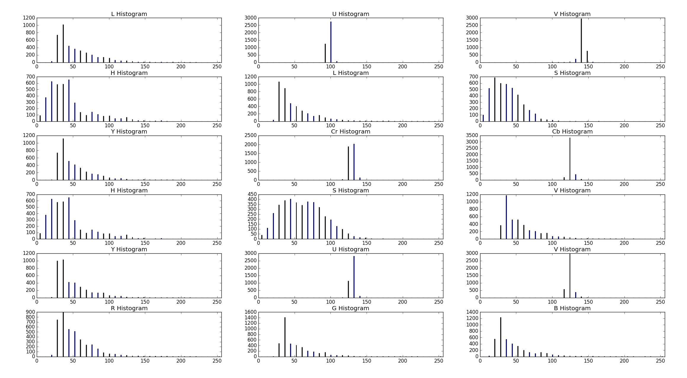

Non-car image example:


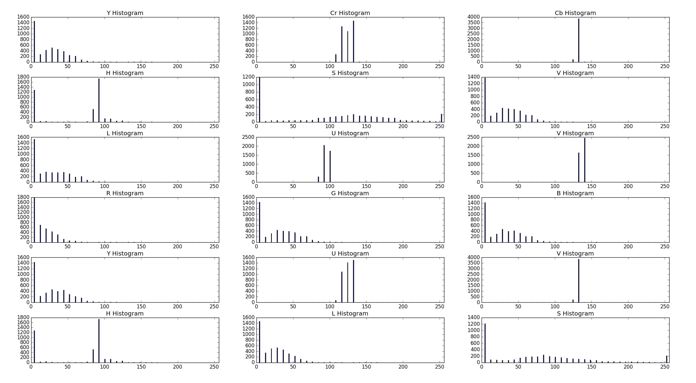

## Code

Code is organized as follows:
- data.py - function for loading dataset (with pickle)
- hog.py - feature extraction functions
- train-hog.py - training hog detector, running detection on test images and video

## Features

I have started with HOG with grayscale image. The results where really bad - few good detections, many false positives.
I have switched to HOG in 3 channels and choosed YUV colorspace for processing. I am making HOG in all channels. I have added spatial features and color histogram to improve results.

From every image following features are extracted:
- HOG (8 pix per cell, 2 cells per block, 9 orientations) from Y (YUV)
- HOG(8,2,9) from U (YUV)
- HOG(8,2,9) from V (YUV)
- spatial features 32,32 (YUV)
- color histogram 32 bins in 3 channels (YUV)

There are 8460 features in total for each image.

### Training

The size of the whole dataset is 18 458. I split 20% for test data.

```
X = np.vstack((car_features, noncar_features)).astype(np.float64)
y = np.hstack((np.ones(len(car_features)),np.zeros(len(noncar_features))))

X_scaler = StandardScaler().fit(X)
scaled_X = X_scaler.transform(X)

rand_state = np.random.randint(0, 100)
X_train, X_test, y_train, y_test = train_test_split(
  scaled_X, y, test_size=0.2, random_state=rand_state)
```

|Training samples | Test samples|
|-----------------|-------------|
|     14766       |    3692     |

The test accuracy is 99.2%

## Processing pipeline

for each image following steps are made:
1. Windows generation (sliding-window technique) `traing-hog/generate_windows`
  - For image use global search
  - For video
    - use global search every 10th frame or when no cars were found in previous frame
    - use local search if detected cars in previous frame
2. Search in windows `traing-hog/search_windows`
3. Compute heatmap `hog/add_heat`
4. Apply threshold `hog/apply_threshold`
5. Find final bounding boxes `scipy.ndimage.measurements/label`

### Sliding-window technique

Choosed windows - global search:
- 96x96   - x: all, y: 400 - 700, overlap: 0.5, 0.25
- 128x128 - x: all, y: 370 - 700, overlap: 0.2, 0.1

Local search is performed in last detection region extended by 30 pixels in x axis both sides.

Choosed windows - local search:
- 48x48   - overlap: 0.2,  0.2
- 64x64   - overlap: 0.75, 0.75
- 96x96   - overlap: 0.75, 0.75
- 128x128 - overlap: 0.2, 0.2

## Results

Here I present my results.

### Images

Results for 6 test images from Udacity. For each image the resulting image containes 4 images described below:

|     | Col1 | Col2 |
|---- |----  |  ----|
| **Row1** | Input| Windows|
| **Row2** | Result|Thresholded heatmap|

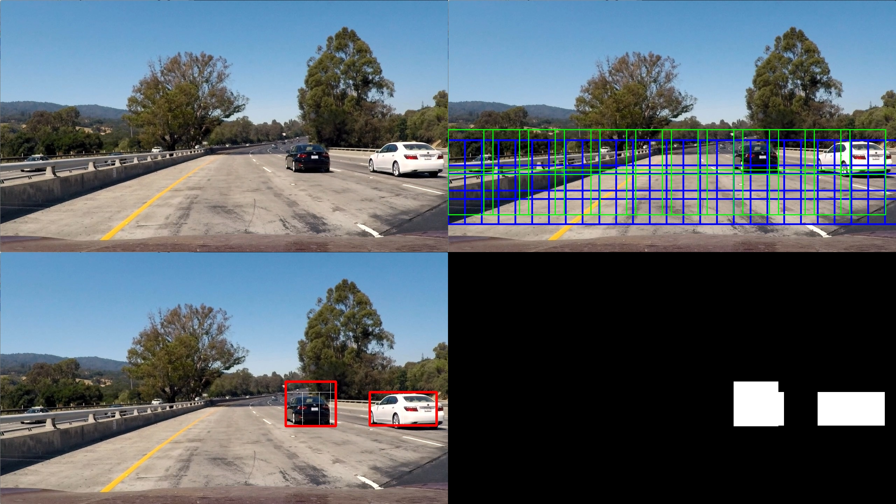

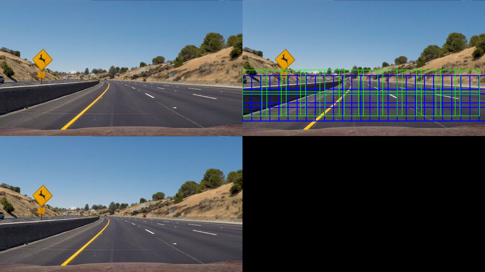

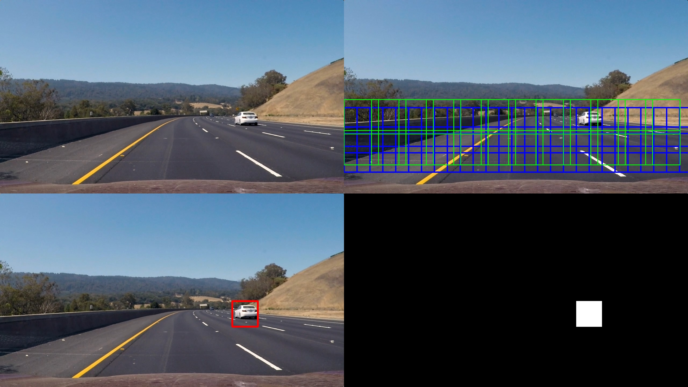

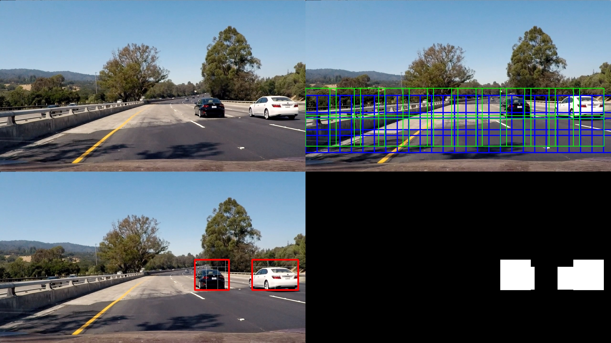

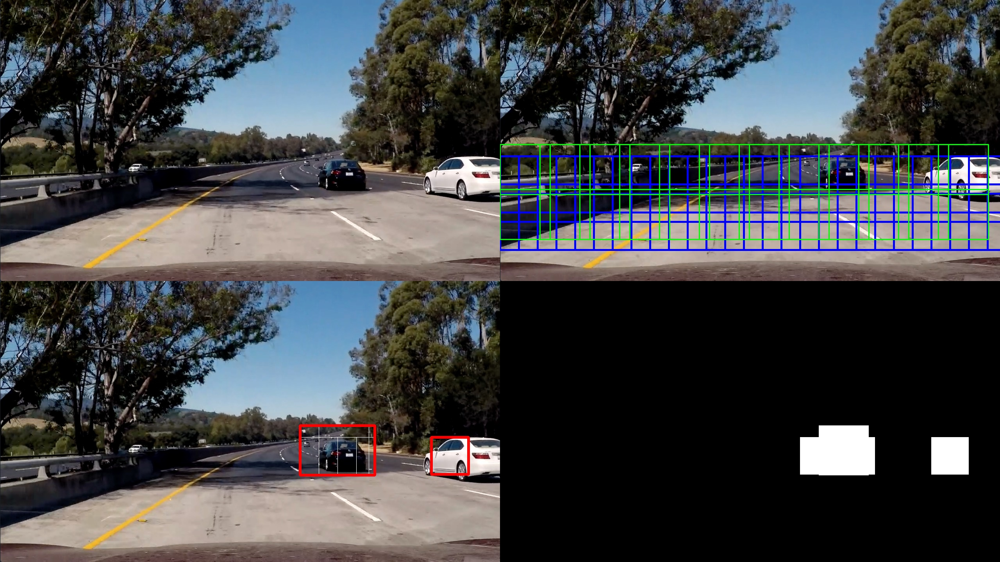

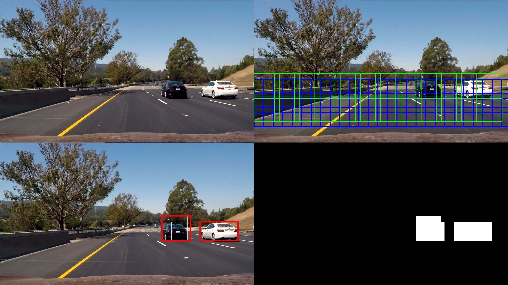

Here is performance/detections graph for test images.

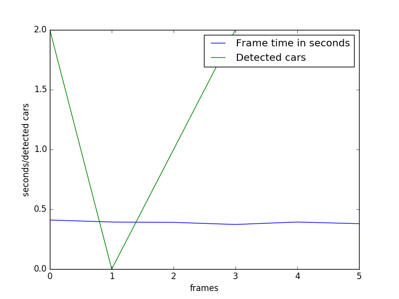

### Videos

Video with results for `project_video.mp4` can be found here on Youtube:

[](https://youtu.be/05MwNP6AQ7w "Vehicle detection video")

Here is detections and computing time plot:

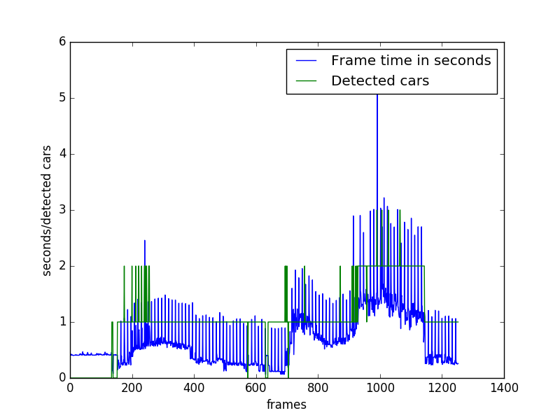

## Discussion

Detection with hog and sliding-window is slow and computation time depends on number of cars detected on image. There are very small number of false positives.

Very promising approach is using deep learning for image detection such as Darknet YOLO or Single Shot Multibox Detector (SSD). I successfully run Darknet Tiny YOLO which is very fast, but have issues with SSD and still working on it.

I have tried building my own very simple net but results were bad. I think the net should work on 32x32x4 images with layers: HSV + edges (laplacian).

### Darknet Tiny YOLO

Tiny YOLO is much faster but less accurate than the normal YOLO model. I am using Tiny YOLO trained on VOC 2007+2012 downloaded from [here](https://pjreddie.com/darknet/yolo/).

Detection on image from dataset:

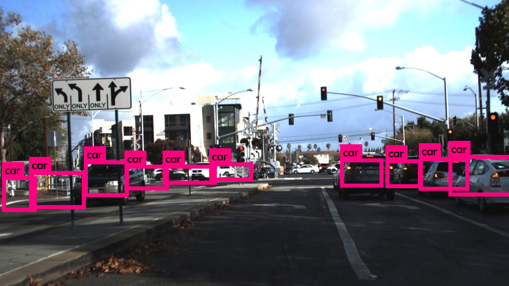

Cars detected on Warsaw streets:

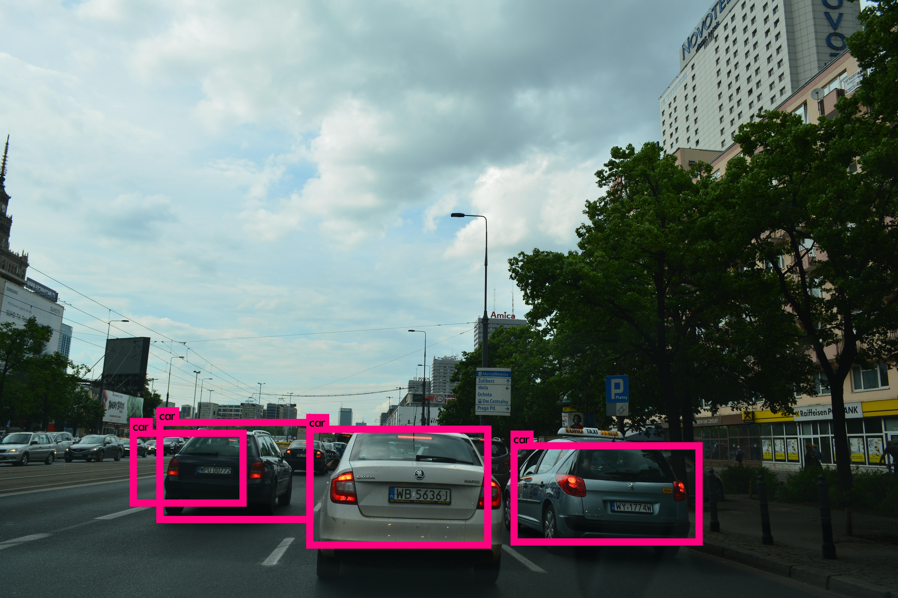

Darknet detected people, cars and bus:

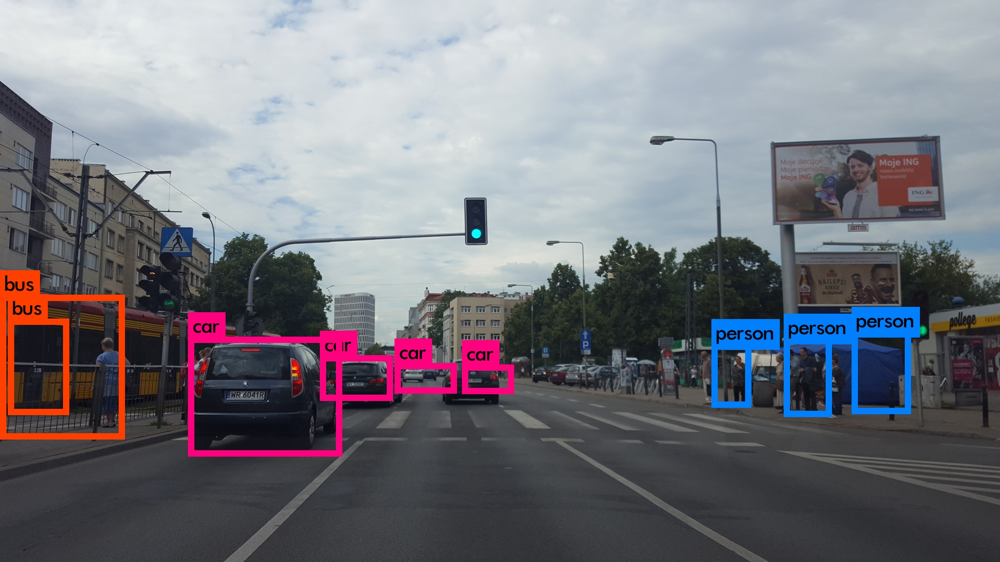

Darknet result for 360 image from Samsung Gear 360:

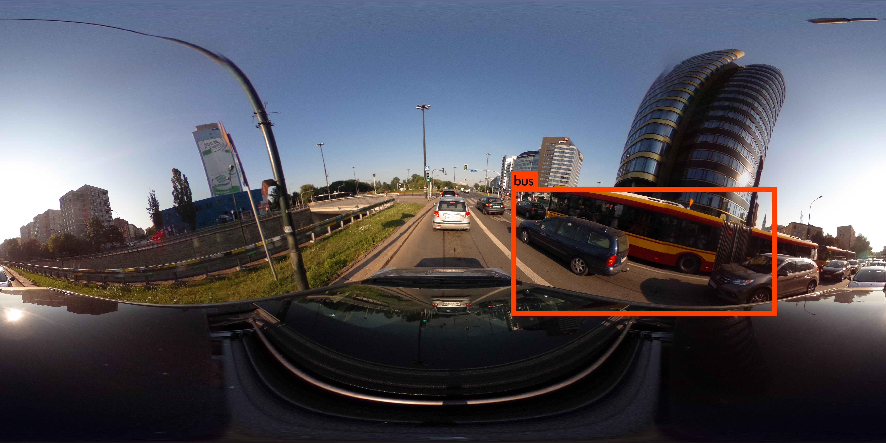
